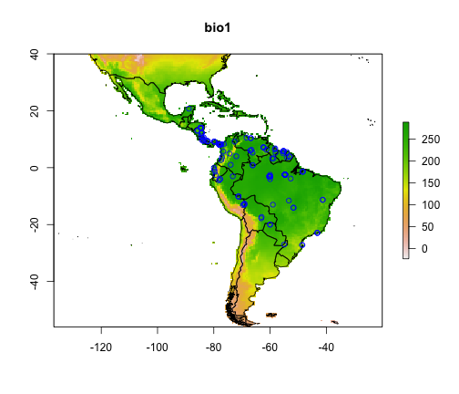

## rgbif use case No. 1 - Ecological niche modelling (aka species distribution modelling)

In this example, we plot actual occurrence data for *Bradypus* species against a single predictor variable, BIO1 (annual mean temperature). This is only ont step in a species distribution modelling nworkflow.

This example can be done using BISON data as well with our `rbison` package.


### Load libraries


```r
library(rgbif)
library(dismo)
library(maptools)
library(plyr)
```


### Make a list of files that are installed with the dismo package, then create a rasterStack from these


```r
files <- list.files(paste(system.file(package = "dismo"), "/ex", sep = ""), 
    "grd", full.names = TRUE)
predictors <- stack(files)
```


### Get world boundaries.


```r
data(wrld_simpl)
```


### Get GBIF data using the rOpenSci package rgbif.

Lookup names


```r
namesdf <- name_lookup(query = "bradypus*", rank = "SPECIES", limit = 60)$data
head(namesdf)
```

```
        key  nubKey parentKey   parent  kingdom   phylum    clazz  order
1 110269569 2436361 124846868 Bradypus Animalia Chordata Mammalia Pilosa
2 110269558 2436351 124846868 Bradypus Animalia Chordata Mammalia Pilosa
3 110579447 2436351 110606319 Bradypus Animalia Chordata Mammalia Pilosa
4   2436351 2436351   2436350 Bradypus Animalia Chordata Mammalia Pilosa
5 125804785 2436351 125814897 Bradypus     <NA>     <NA>     <NA> Pilosa
6 110516334 2436361 110606319 Bradypus Animalia Chordata Mammalia Pilosa
        family    genus kingdomKey phylumKey  classKey  orderKey familyKey
1 Bradypodidae Bradypus  124836057 124839309 124846085 124846866 124846867
2 Bradypodidae Bradypus  124836057 124839309 124846085 124846866 124846867
3 Bradypodidae Bradypus  116630539 116842680 116665331 131755266 131755267
4 Bradypodidae Bradypus          1        44       359      1494      9418
5 Bradypodidae Bradypus         NA        NA        NA 131720904 131720905
6 Bradypodidae Bradypus  116630539 116842680 116665331 131755266 131755267
   genusKey        canonicalName       authorship   nameType    rank
1 124846868 Bradypus tridactylus   Linnaeus, 1758 WELLFORMED SPECIES
2 124846868   Bradypus torquatus    Illiger, 1811 WELLFORMED SPECIES
3 110606319   Bradypus torquatus    Illiger, 1811 WELLFORMED SPECIES
4   2436350   Bradypus torquatus    Illiger, 1811 WELLFORMED SPECIES
5 125814897   Bradypus torquatus  (Illiger, 1811)    SCINAME SPECIES
6 110606319 Bradypus tridactylus   Linnaeus, 1758 WELLFORMED SPECIES
  numOccurrences
1              0
2              0
3              0
4              0
5              0
6              0
```


Get some name keys


```r
keys <- na.omit(unique(namesdf$nubKey))
```


Get occurrence data


```r
df <- occ_search(keys, georeferenced = TRUE, limit = 100, return = "data")
df <- df[sapply(df, class) == "data.frame"]
df2 <- ldply(df)
df2 <- data.frame(lon = df2$longitude, lat = df2$latitude)
```


### Plot: (1) Add raster data, (2) Add political boundaries, (3) Add the points (occurrences)


```r
plot(predictors, 1)
plot(wrld_simpl, add = TRUE)
points(df2, col = "blue")
```

 


### Further reading

The above example comes from [this tutorial][sdm] on species distribution modeling. 

Warning: tutorial no longer there...

[sdm]: http://cran.r-project.org/web/packages/dismo/vignettes/sdm.pdf
